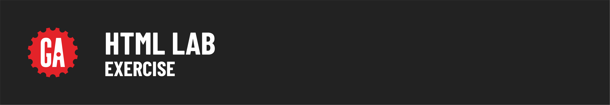
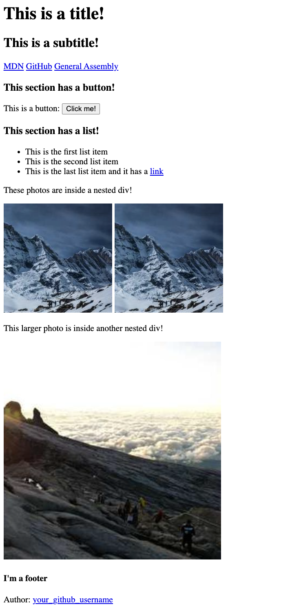

# 

## Introduction

This lab provides an opportunity to practice creating and nesting HTML elements, along with gaining more familiarity with how block and inline elements interact in the browser.

Your final UI in the browser will look like the following image. 

### A quick note before you dive in

If you get stuck during the lab, we recommend revisiting the lesson materials first. They're designed to provide you with the information and examples that will help you complete the exercises.

## Lab Exercises

Before we get started, let's set up our boilerplate.

1. Open `index.html`.
2. Type `!` and press `Tab` to create the standard HTML boilerplate.
3. Change the document's title to "HTML Lab."

### Exercise 1: Create a header

1. Inside the `body`, create a `header` element.
2. Inside the `header`, add:
   - An `h1` with the text "This is a title!"
   - An `h2` with the text "This is a subtitle!"

### Exercise 2: Create a navigation bar

1. Below the `header`, create a `nav` element.
2. Inside the `nav`, add three links or "anchor" tags:
   - A link to [MDN](https://developer.mozilla.org/en-US/) with the text "MDN".
   - A link to [GitHub](https://github.com/) with the text "GitHub".
   - A link to [General Assembly](https://generalassemb.ly/) with the text "General Assembly".

### Exercise 3: Create a button section

1. Below the `nav`, create a `section` element.
2. Inside the `section`, add:
   - An `h3` with the text "This section has a button!"
   - A `p` with the text "This is a button:", followed by a `button` with the text "Click me!" (the button should display **_inline_** and be on the same line as the text). The button does not need to preform any actions when clicked.

### Exercise 4: Create a section for an unordered list

1. Below the previous `section`, create a new `section` element.
2. Inside the new `section`, add:
   - An `h3` with the text "This section has a list!"
   - A `ul` with three `li` items:
     - First `li`: "This is the first list item"
     - Second `li`: "This is the second list item"
     - Third `li`: "This is the last list item and it has a link". Wrap the word "link" in an anchor element, and give it an `href` attribute pointing to [Google](http://www.google.com).

### Exercise 5: Create nested divisions with images

For this exercise, we'll be using [Lorem Picsum](https://picsum.photos/) to generate placeholder images. By perusing the documentation, we can see that grabbing a random image from the site is fairly straightforward. We combine the base url `https://picsum.photos/` with a number that represents a dimension in pixels, such as `500`.

We can then add that URL to the `href` attribute of an `img` element, and we'll get back a randomized image that is 500x500 pixels in size.

1. Below the previous `section`, create a `div` element.
2. Inside this `div`, add two child `div` elements:
   - First child `div`:
     - A `p` with the text "These photos are inside a nested div!"
     - Two `img` elements with URLs from [Lorem Picsum](https://picsum.photos/200) (200x200 pixels), each with `alt` text "placeholder photo".
   - Second child `div`:
     - A `p` with the text "This larger photo is inside another nested div!"
     - An `img` element with a URL from [Lorem Picsum](https://picsum.photos/400) (400x400 pixels), with `alt` text "large placeholder photo".

### Exercise 6: Create a footer

1. Below the parent `div`, create a `footer` element.
2. Inside the `footer`, add:
   - An `h4` with the text "I'm a footer".
   - A `p` with the text "Author: ", followed by a link to your personal GitHub account.
